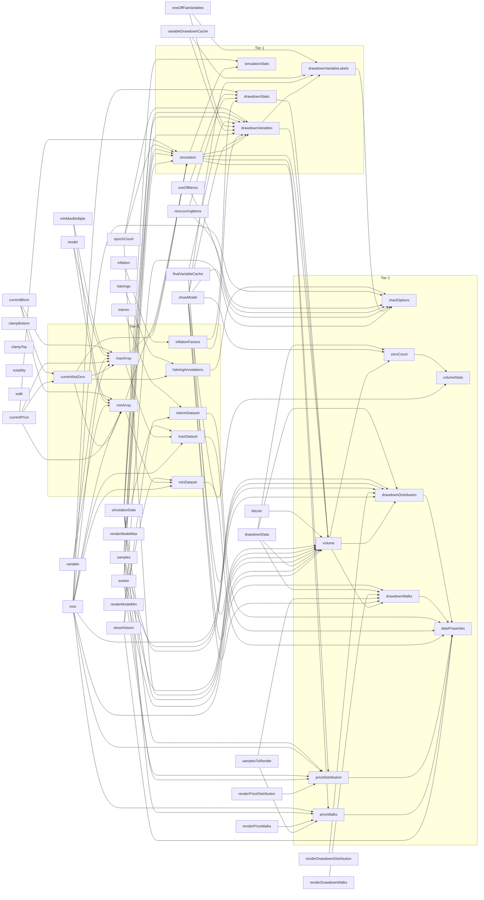

# Stack Math: The Bitcoin Modeling Engine

[](https://opensource.org/licenses/MIT)
[](https://nodejs.org/)
[](https://www.typescriptlang.org/)

Stack Math is an open-source Monte Carlo framework that combines ergodic walk strategies with traditional Bitcoin pricing models to generate probabilistic financial planning scenarios. It bridges the gap between theoretical Bitcoin models and practical financial decision-making needs.

## Features

- **Advanced Price Modeling**

  - Boundary Definition using established models (Power Law, Rainbow, etc.)
  - Ergodic Walk Strategies within defined boundaries
  - Monte Carlo Simulation generating thousands of price trajectories
  - Normal and Regression Distribution analysis for price and drawdown

- **Financial Planning Tools**

  - Retirement planning scenarios
  - Major purchase modeling
  - Recurring expense calculations
  - Monetary inflation impact analysis

- **Technical Implementation**
  - Client-side computation using Web Workers
  - Fully transparent and verifiable open-source framework
  - Custom-built dependency tree for deterministic results
  - React and TypeScript-based architecture

## Installation

```bash
# Clone the repository
git clone https://github.com/yourusername/stack-math.git

# Install dependencies
npm install

# Start development server
npm run dev

# Build for production
npm run build
```

## System Requirements

- Node.js >= 18.0.0
- Modern browser with ES6 module support

## Development

```bash
# Run tests
npm test

# Run linter
npm run lint

# Preview production build
npm run preview
```

## Architecture

Stack Math implements a sophisticated architecture that includes:

- Dedicated web workers for computation-intensive Monte Carlo simulations
- Custom dependency tree management for calculation ordering
- Client-side execution for data privacy
- Responsive UI with React and styled-components
- Comprehensive charting capabilities using Chart.js

## Contributing

We welcome contributions! Please feel free to submit a Pull Request. For major changes, please open an issue first to discuss what you would like to change.

## Security

All operations execute client-side, ensuring user data privacy. No sensitive financial data is transmitted over the network.

## License

This project is licensed under the MIT License - see the [LICENSE](LICENSE) file for details.

## Project Structure

```
src/
├── api.ts                 # API interfaces
├── components/           # React components
├── contexts/            # React contexts
├── data/               # Data models and datasets
│   ├── models/        # Price prediction models
│   └── walks/         # Walk strategy implementations
├── panels/            # Main UI panels
└── tutorial/          # Interactive tutorial
```

## Credits

Stack Math is the culmination of six years of work in Bitcoin modeling and financial planning technology. The project represents a fundamental rethinking of how we approach Bitcoin price prediction and practical financial planning.

## Support

For questions, feature requests, or bug reports, please open an issue on our GitHub repository.

---

**Note:** Stack Math is currently in public beta. While the core functionality is stable, we're continuously working on improvements and welcome community feedback.

## Internal Dependency Graph


