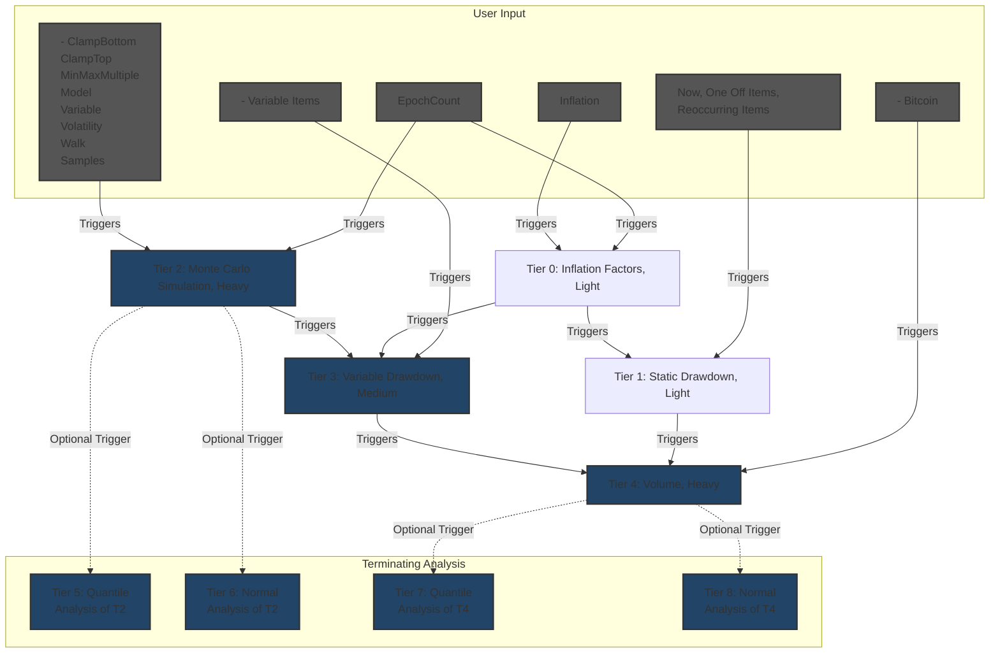
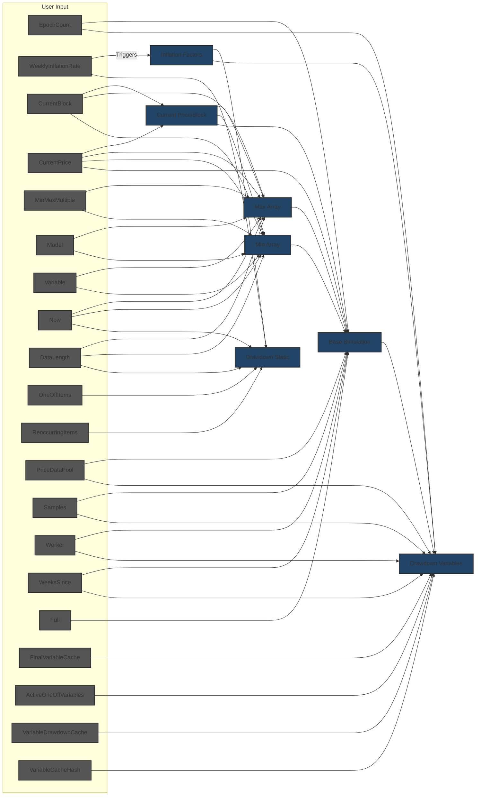

```mermaid
graph TD

    subgraph "User Input"
      EpochCount[EpochCount]
      UI0[Inflation]
      UI1[Now, One Off Items, Reoccurring Items]
      UI2[- ClampBottom\n ClampTop\n MinMaxMultiple\n Model\n Variable\n Volatility\n Walk\n Samples]
      UI3[- Variable Items]
      UI4[- Bitcoin]
    end

    EpochCount -->|Triggers| T0
    EpochCount -->|Triggers| T2
    UI0 -->|Triggers| T0
    UI1 -->|Triggers| T1
    UI2 -->|Triggers| T2
    UI3 -->|Triggers| T3
    UI4 -->|Triggers| T4

    T0[Tier 0: Inflation Factors, Light]
    T1[Tier 1: Static Drawdown, Light]
    T2[Tier 2: Monte Carlo Simulation, Heavy]
    T3[Tier 3: Variable Drawdown, Medium]
    T4[Tier 4: Volume, Heavy]

    subgraph "Terminating Analysis"
      T5[Tier 5: Quantile\nAnalysis of T2]
      T6[Tier 6: Normal\nAnalysis of T2]
      T7[Tier 7: Quantile\nAnalysis of T4]
      T8[Tier 8: Normal\nAnalysis of T4]
    end

    T0 -->|Triggers| T1
    T0 -->|Triggers| T3
    T1 -->|Triggers| T4
    T2 -->|Triggers| T3
    T3 -->|Triggers| T4
    T2 -.->|Optional Trigger| T5
    T2 -.->|Optional Trigger| T6
    T4 -.->|Optional Trigger| T7
    T4 -.->|Optional Trigger| T8

    classDef workerPath fill:#246,stroke:#333,stroke-width:2px;
    classDef userInput fill:#555,stroke:#333,stroke-width:2px,text-align:left;
    classDef optional fill:#888,stroke:#333,stroke-width:1px;
    class T2,T3,T4,T5,T6,T7,T8 workerPath;
    class EpochCount,UI0,UI1,UI2,UI3,UI4 userInput;

```

```mermaid
graph LR

    subgraph "User Input"
      EpochCount[EpochCount]
      WeeklyInflationRate[WeeklyInflationRate]
      CurrentBlock[CurrentBlock]
      CurrentPrice[CurrentPrice]
      MinMaxMultiple[MinMaxMultiple]
      Model[Model]
      Variable[Variable]
      Now[Now]
      DataLength[DataLength]
      OneOffItems[OneOffItems]
      ReoccurringItems[ReoccurringItems]
      PriceDataPool[PriceDataPool]
      Samples[Samples]
      Worker[Worker]
      WeeksSince[WeeksSince]
      Full[Full]
      FinalVariableCache[FinalVariableCache]
      ActiveOneOffVariables[ActiveOneOffVariables]
      VariableDrawdownCache[VariableDrawdownCache]
      VariableCacheHash[VariableCacheHash]
    end

    WeeklyInflationRate -->|Triggers| InflationFactors
    CurrentBlock --> CurrentNotZero
    CurrentPrice --> CurrentNotZero

    CurrentBlock --> MaxArray
    MinMaxMultiple --> MaxArray
    Model --> MaxArray
    Variable --> MaxArray
    CurrentPrice --> MaxArray
    Now --> MaxArray
    DataLength --> MaxArray
    CurrentNotZero --> MaxArray

    CurrentBlock --> MinArray
    MinMaxMultiple --> MinArray
    Model --> MinArray
    Variable --> MinArray
    CurrentPrice --> MinArray
    Now --> MinArray
    DataLength --> MinArray
    CurrentNotZero --> MinArray

    InflationFactors[Inflation Factors]
    CurrentNotZero[Current Price/Block]
    MaxArray[Max Array]
    MinArray[Min Array]

    DataLength --> DrawdownStatic
    Now --> DrawdownStatic
    OneOffItems --> DrawdownStatic
    ReoccurringItems --> DrawdownStatic
    InflationFactors --> DrawdownStatic
    WeeklyInflationRate --> DrawdownStatic

    DrawdownStatic[Drawdown Static]

    CurrentPrice --> Simulation
    MinArray --> Simulation
    MaxArray --> Simulation
    EpochCount --> Simulation
    PriceDataPool --> Simulation
    Samples --> Simulation
    Worker --> Simulation
    WeeksSince --> Simulation
    Full --> Simulation
    CurrentNotZero --> Simulation

    Simulation[Base Simulation]

    EpochCount --> DrawdownVariables
    Samples --> DrawdownVariables
    PriceDataPool --> DrawdownVariables
    FinalVariableCache --> DrawdownVariables
    ActiveOneOffVariables --> DrawdownVariables
    VariableDrawdownCache --> DrawdownVariables
    Worker --> DrawdownVariables
    InflationFactors --> DrawdownVariables
    WeeksSince --> DrawdownVariables
    VariableCacheHash --> DrawdownVariables
    Simulation --> DrawdownVariables

    DrawdownVariables[Drawdown Variables]

    classDef userInput fill:#555,stroke:#333,stroke-width:2px,text-align:left;
    classDef calculation fill:#246,stroke:#333,stroke-width:2px;
    class EpochCount,WeeklyInflationRate,CurrentBlock,CurrentPrice,MinMaxMultiple,Model,Variable,Now,DataLength,OneOffItems,ReoccurringItems,PriceDataPool,Samples,Worker,WeeksSince,Full,FinalVariableCache,ActiveOneOffVariables,VariableDrawdownCache,VariableCacheHash userInput;
    class InflationFactors,CurrentNotZero,MaxArray,MinArray,DrawdownStatic,Simulation,DrawdownVariables calculation;
```
